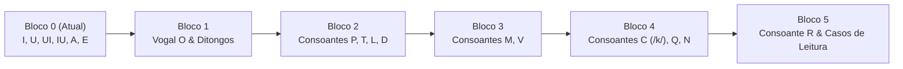

# Plano Curricular do 1.º Semestre — Aventura das Letras 🦕

> **Referência Curricular:** Aprendizagens Essenciais do 1.º Ciclo do Ensino Básico (1.º Ano) — Ministério da Educação / DGE (Portugal), alinhado com a progressão fonológica dos manuais escolares portugueses (*Plim!*, *TOP!*, *Alfa*, *Pasta Mágica*).
> **Âmbito:** Exclusivamente **1.º Semestre** (Setembro a Janeiro). As letras e casos do 2.º Semestre (*B, G, J, F, S, Z, H, X, K, W, Y*, dígrafos *ch/nh/lh*, encontros *pr/bl/etc.*) ficam reservadas para a fase seguinte.

---

## 1. Estado Atual do Projeto: O que já temos 🟢

Atualmente, o jogo tem implementadas e calibradas com áudio pt-PT (**RaquelNeural**), minijogos e traçado cursivo as seguintes letras e combinações:

| Elemento | Tipo | Palavras Iniciais (Explorador) | Palavras de Meio (Detetive) | Estado |
| :---: | :---: | :--- | :--- | :---: |
| **I** | Vogal | *Ilha*, *Igreja*, *Íman*, *Iguana* | *Peixe*, *Livro*, *Rainha*, *Biscoito* | ✅ Implementado |
| **U** | Vogal | *Urso*, *Uvas*, *Unha*, *Unicórnio* | *Lua*, *Nuvem*, *Coruja*, *Tartaruga* | ✅ Implementado |
| **UI** | Ditongo | *Ui!*, *Uivo*, *Cuidado*, *Fui* | *Ui!*, *Uivo*, *Cuidado*, *Fui* | ✅ Implementado |
| **IU** | Ditongo | *Viu*, *Riu*, *Subiu*, *Fugiu* | *Viu*, *Riu*, *Subiu*, *Fugiu* | ✅ Implementado |
| **A** | Vogal | *Árvore*, *Água*, *Asa*, *Avião* | *Gato*, *Barco*, *Casa*, *Banana* | ✅ Implementado |
| **E** | Vogal | *Égua*, *Eco*, *Estrela*, *Elefante* | *Vela*, *Coelho*, *Dente*, *Estrela* | ✅ Implementado |

> **Nota:** Em `src/types/game.ts`: `LetterKey = 'I' | 'U' | 'UI' | 'IU' | 'A' | 'E'`.

---

## 2. O que falta para completar o 1.º Semestre ("Next to Come") 🟡

Para cobrir a totalidade do plano pedagógico do **1.º Semestre**, organizamos as próximas adições em **4 blocos sequenciais**:

---

### 📦 Bloco 1: Conclusão das Vogais e Ditongos Fundamentais
Fecha o ciclo das 5 vogais primárias e equipa a criança com todos os ditongos orais e nasais frequentes.

1. **Vogal O**
   - **Som:** `/ɔ/` (aberto: Ó) / `/o/` (fechado: Ô).
   - **Palavras Explorador:** *Olho* 👁️, *Ovelha* 🐑, *Ovo* 🥚, *Ouriço* 🦔.
   - **Palavras Detetive:** *Sol*, *Bolo*, *Porco*, *Comboio*.
   - **Traçado cursivo:** Círculo perfeito no sentido anti-horário com lacinho de saída superior.

2. **Ditongos com O: OI, OU**
   - **Palavras OI:** *Oi!* 👋, *Oito* 8️⃣, *Noite* 🌙, *Biscoito* 🍪.
   - **Palavras OU:** *Ouro* 🪙, *Tesouro* 💎, *Touro* 🐂, *Cenoura* 🥕.

3. **Ditongos com A: AI, AU, ÃO**
   - **Palavras AI:** *Pai* 👨, *Praia* 🏖️, *Caixa* 📦, *Gaivota* 🕊️.
   - **Palavras AU:** *Au-au!* 🐶, *Mau* 🦹, *Pau* 🪵, *Flauta* 🪈.
   - **Palavras ÃO (Ditongo nasal clássico pt-PT):** *Cão* 🐕, *Mão* ✋, *Pão* 🥖, *Leão* 🦁.

4. **Ditongos com E: EI, EU, ÃE, ÕE**
   - **Palavras EI:** *Rei* 👑, *Peixe* 🐟, *Leite* 🥛, *Queijo* 🧀.
   - **Palavras EU:** *Eu* 🙋, *Meu* 🎁, *Céu* ⛅, *Pneu* 🛞.
   - **Palavras ÃE / ÕE:** *Mãe* 👩, *Pães* 🥖, *Balões* 🎈, *Botões* 🔘.

---

### 📦 Bloco 2: Primeiras Consoantes de Alta Produtividade (P, T, L, D)
Permitem formar imediatamente dezenas de palavras simples de sílaba direta Consoante-Vogal (CV).

1. **Consoante P**
   - **Som fónico:** Som oclusivo bilabial surdo `/p/` (*"P-p-p, o som da pipoca a estalar!"*).
   - **Palavras Explorador:** *Pato* 🦆, *Pá* 🪴, *Pipa* 🪁, *Pão* 🥖.
   - **Palavras Detetive:** *Sopa*, *Copo*, *Sapo*, *Mapa*.
   - **Formação de sílabas:** *pa, pe, pi, po, pu*.

2. **Consoante T**
   - **Som fónico:** Som oclusivo dental surdo `/t/` (*"T-t-t, o som do relógio: tique-taque!"*).
   - **Palavras Explorador:** *Tomate* 🍅, *Tatu* 🦔, *Teia* 🕸️, *Tartaruga* 🐢.
   - **Palavras Detetive:** *Gato*, *Bota*, *Lata*, *Apito*.
   - **Formação de sílabas:** *ta, te, ti, to, tu*.

3. **Consoante L**
   - **Som fónico:** Som lateral alveolar sonoro `/l/` (*"Lll, a língua sobe ao céu da boca!"*).
   - **Palavras Explorador:** *Lua* 🌙, *Lobo* 🐺, *Lata* 🥫, *Limão* 🍋.
   - **Palavras Detetive:** *Bola*, *Bolo*, *Vela*, *Mala*.
   - **Formação de sílabas:** *la, le, li, lo, lu*.

4. **Consoante D**
   - **Som fónico:** Som oclusivo dental sonoro `/d/` (*"D-d-d, o bater da porta!"*).
   - **Palavras Explorador:** *Dado* 🎲, *Dedo* ☝️, *Doce* 🍬, *Dinossauro* 🦕.
   - **Palavras Detetive:** *Corda*, *Fada*, *Roda*, *Moeda*.
   - **Formação de sílabas:** *da, de, di, do, du*.

---

### 📦 Bloco 3: Consoantes Contínuas & Labiais (M, V)
Sons fáceis de prolongar oralmente, facilitando a fusão auditiva com as vogais.

1. **Consoante M**
   - **Som fónico:** Som nasal bilabial `/m/` (*"Mmm, como quando uma comida é tão boa!"*).
   - **Palavras Explorador:** *Mala* 🧳, *Macaco* 🐒, *Maçã* 🍎, *Mota* 🛵.
   - **Palavras Detetive:** *Cama*, *Lama*, *Tomate*, *Limão*.
   - **Formação de sílabas:** *ma, me, mi, mo, mu, mão*.

2. **Consoante V**
   - **Som fónico:** Som fricativo labiodental sonoro `/v/` (*"Vvv, o motor do avião a vibrar!"*).
   - **Palavras Explorador:** *Vaca* 🐮, *Vela* 🕯️, *Vaso* 🏺, *Violino* 🎻.
   - **Palavras Detetive:** *Ovo*, *Uva*, *Nuvem*, *Livro*.
   - **Formação de sílabas:** *va, ve, vi, vo, vu, vão*.

---

### 📦 Bloco 4: Consoantes Velares & Nasais (C, Q, N)
Consolidação do código com sons regulares nesta fase inicial.

1. **Consoante C (som duro /k/)**
   - **Nota Pedagógica:** No 1.º Semestre trabalha-se estritamente o som duro `/k/` com *a, o, u* (*ca, co, cu*). Os casos *ce/ci* e *ç* pertencem ao 2.º Semestre.
   - **Palavras Explorador:** *Casa* 🏠, *Cão* 🐕, *Copo* 🥛, *Cama* 🛏️.
   - **Palavras Detetive:** *Macaco*, *Barco*, *Boca*, *Faca*.

2. **Consoante Q (qu)**
   - **Nota Pedagógica:** Acompanhada sempre pelo *u* (*qua, que, qui*).
   - **Palavras Explorador:** *Queijo* 🧀, *Quarto* 🚪, *Quadro* 🖼️, *Quatro* 4️⃣.
   - **Palavras Detetive:** *Leque*, *Parque*, *Máquina*, *Esquilo*.

3. **Consoante N**
   - **Som fónico:** Som nasal alveolar `/n/` (*"Nnn, a língua toca atrás dos dentes!"*).
   - **Palavras Explorador:** *Navio* 🚢, *Ninho* 🪺, *Noz* 🌰, *Nuvem* ☁️.
   - **Palavras Detetive:** *Banana*, *Pena*, *Canoa*, *Menina*.
   - **Formação de sílabas:** *na, ne, ni, no, nu*.

---

### 📦 Bloco 5: A Consoante R & Casos de Leitura do 1.º Semestre
O estudo do R e das suas variações fonéticas mais acessíveis.

1. **Consoante R Inicial (som forte /ʁ/)**
   - **Palavras Explorador:** *Rato* 🐭, *Roda* 🛞, *Rei* 👑, *Rua* 🛣️.
   - **Palavras Detetive:** *Rã*, *Robô*, *Rio*, *Relógio*.

2. **Casos de Leitura do R:**
   - **R brando entre vogais (...r...):** *Pera* 🍐, *Coruja* 🦉, *Arara* 🦜, *Tesoura* ✂️.
   - **R duplo (rr):** *Carro* 🚗, *Jarra* 🏺, *Torre* 🏰, *Terra* 🌍.
   - **Sílaba com R no final (ar, er, ir, or, ur):** *Mar* 🌊, *Flor* 🌸, *Urso* 🐻, *Barco* ⛵.

---

## 3. Resumo da Matriz de Implementação — 1.º Semestre 📋

| # | Identificador (`LetterKey`) | Tipo | Foco Pedagógico | Áudios a Gerar |
| :-: | :---: | :---: | :--- | :---: |
| 1 | `O` | Vogal | Fecho das vogais | 4 palavras + traçado + intro |
| 2 | `OI`, `OU` | Ditongos | Ditongos com O | 4 palavras cada + intro |
| 3 | `AI`, `AU`, `AO` | Ditongos | Ditongos com A & nasal ão | 4 palavras cada + intro |
| 4 | `EI`, `EU`, `AE`, `OE` | Ditongos | Ditongos com E & nasais | 4 palavras cada + intro |
| 5 | `P` | Consoante | Oclusiva bilabial (`/p/`) | 4 palavras + traçado + intro |
| 6 | `T` | Consoante | Oclusiva dental (`/t/`) | 4 palavras + traçado + intro |
| 7 | `L` | Consoante | Lateral alveolar (`/l/`) | 4 palavras + traçado + intro |
| 8 | `D` | Consoante | Oclusiva dental (`/d/`) | 4 palavras + traçado + intro |
| 9 | `M` | Consoante | Nasal bilabial (`/m/`) | 4 palavras + traçado + intro |
| 10 | `V` | Consoante | Fricativa labiodental (`/v/`) | 4 palavras + traçado + intro |
| 11 | `C` | Consoante | Som duro `/k/` (*ca, co, cu*) | 4 palavras + traçado + intro |
| 12 | `Q` | Consoante | Dígrafo *qu* (*que, qui, qua*) | 4 palavras + traçado + intro |
| 13 | `N` | Consoante | Nasal alveolar (`/n/`) | 4 palavras + traçado + intro |
| 14 | `R` | Consoante | R inicial forte | 4 palavras + traçado + intro |
| 15 | `RR_R_AR` | Casos de Leitura | *rr*, *...r...*, *ar/er/ir/or/ur* | 4 palavras comparativas |

---

## 4. Requisitos Técnicos & Checklist para Implementação 🛠️

Ao adicionar cada novo bloco:

1. **`src/types/game.ts`:**
   - Expandir a união `LetterKey` com a respetiva letra/combinação.
2. **`scripts/generate_audio.py`:**
   - Adicionar os pares `(key, phrase)` para a voz `pt-PT-RaquelNeural`.
   - Executar `python scripts/generate_audio.py` para produzir os ficheiros `.mp3` e atualizar `manifest.json`.
3. **`src/data/gameData.ts`:**
   - Inserir objeto completo em `letters[key]`: sons, frases do Dino, 4 palavras modelo com emoji, `middleWords` para o Detetive, e pontos SVG de caligrafia cursiva escolar.
   - Criar os passos sequenciais em `steps[]` (Explorador ➔ Bolhas ➔ Detetive ➔ Traçado).
4. **Regras Pedagógicas de Distratores (evitar regressão P0.4 do `PROJECT_REVIEW.md`):**
   - O jogo das bolhas de uma nova letra **só deve usar como distratores letras já aprendidas anteriormente**.
   - As opções do Quiz devem ser baralhadas dinamicamente (Fisher-Yates) para a resposta certa não ficar sempre na mesma posição.

---

## 5. Delimitação Exclusiva: O que Fica para o 2.º Semestre 🚫

Para clareza e controlo de âmbito, os seguintes conteúdos **não** entram nesta fase:
* **Consoantes do 2.º Semestre:** `B`, `G`, `J`, `F`, `S`, `Z`, `H`, `X`, `K`, `W`, `Y`.
* **Dígrafos e Casos Complexos:** `CH`, `NH`, `LH`, `ce/ci`, `ça/ço/çu`, `gue/gui`, `ge/gi`, `s/ss`, `x` e os seus valores fonéticos.
* **Grupos Consonantais (CCV):** *pr, tr, br, cr, dr, fr, gr, vr* e *pl, bl, cl, fl, gl, tl*.
